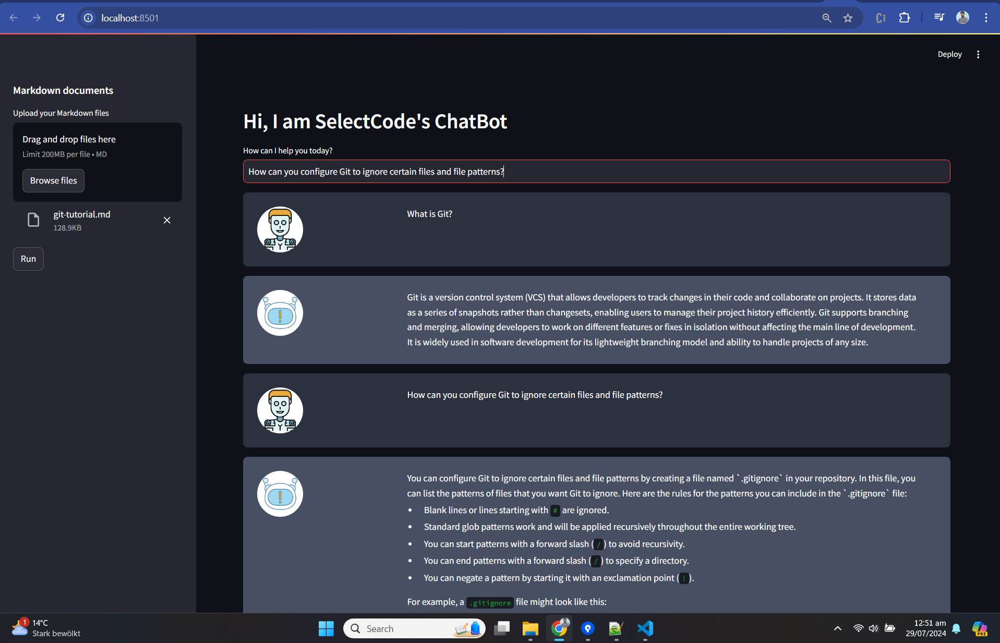

# ChatBot with RAG (Retrieval-Augmented Generation) Implementation



## Overview

This project demonstrates a working chatbot using Streamlit and RAG (Retrieval-Augmented Generation) to provide intelligent responses based on uploaded documents. The architecture is modular, with logging and error handling implemented for better maintainability and debugging.

### Architecture

1. **Frontend**: Built using Streamlit for a user-friendly interface where users can upload Markdown files and interact with the chatbot.
2. **Backend**:
   - **Document Preprocessing**: Extracts content from Markdown documents and splits them into manageable chunks.
   - **Embeddings and Retrievers**: Generates embeddings for text chunks using OpenAI and creates ensemble retrievers (BM25 and FAISS).
   - **Conversational Chain**: Utilizes LangChain's conversational retrieval chain to manage chat history and generate responses.
   - **Evaluation**: Tests retriever performance and records feedback using `trulens_eval`.

## Installation and Usage

### Using Docker

1. **Build Docker Image**:
    ```bash
    docker build -t chat_with_pdfs .
    ```

2. **Run Docker Container**:
    ```bash
    docker run -p 8501:8501 chat_with_pdfs
    ```

3. **Access the App**:
    Open your browser and go to `http://localhost:8501`

### Using Streamlit Run Command

1. **Install Dependencies**:
    ```bash
    pip install -r requirements.txt
    ```

2. **Run the App**:
    ```bash
    streamlit run main.py
    ```

3. **Access the App**:
    Open your browser and go to `http://localhost:8501`

## RAG Implementation

### Preprocessing
- **Markdown Content Extraction**:
  - Extracts text content from uploaded Markdown files.
  - Uses `get_md_content` to read and decode file content.

### Embeddings and Retrievers
- **Chunking**:
  - Splits large text into smaller chunks using `CharacterTextSplitter` to handle large inputs efficiently.
- **Embeddings**:
  - Uses OpenAI's embeddings to transform text chunks into vectors.
- **Retrievers**:
  - Combines BM25 and FAISS retrievers into an ensemble for robust retrieval of relevant contexts.

### Conversational Chain
- **Language Model**:
  - Utilizes `ChatOpenAI` for generating responses.
- **Memory**:
  - Keeps track of the conversation history using `ConversationBufferMemory`.
- **Chain**:
  - Forms a conversational retrieval chain with the ensemble retriever, facilitating context-aware interactions.

### Evaluation
- **Feedback Recording**:
  - Tests retriever performance using predefined questions.
  - Records feedback on answer and context relevance, saving results to CSV files.

## Assumptions

- **Document Format**: Assumes that documents uploaded are in Markdown format.
- **Model**: Uses OpenAI's GPT-4o-mini model for response generation.
- **Evaluation**: Assumes that feedback mechanisms provided by `trulens_eval` accurately reflect retriever performance.

## Why Streamlit

- **User-Friendly Interface**: Provides an easy-to-use interface for interacting with the chatbot.
- **Rapid Development**: Allows quick prototyping and deployment of the chatbot.
- **Visualization**: Streamlit's components facilitate visualization of chat interactions and feedback results.

## Alternative Architecture

For production-ready chatbots, consider using frameworks like FastAPI to develop microservices. This architecture provides better scalability and integration with other services. Here's a high-level overview:

1. **FastAPI Backend**:
   - Microservice handling user requests and managing conversation state.
   - Separate services for preprocessing, embedding, and retrieval.

2. **Frontend**:
   - Can be a web application (React, Angular) or a mobile app.

3. **Database**:
   - To store chat history, user data, and feedback.

4. **Deployment**:
   - Use Docker and Kubernetes for containerization and orchestration.

## Sample Chat Image

Below is an example of a conversation with the chatbot. (Add your image here)


By following this guide, you'll be able to set up and run a chatbot that leverages RAG to provide contextually relevant responses. Adjustments can be made based on the specific requirements of your application and deployment environment.
